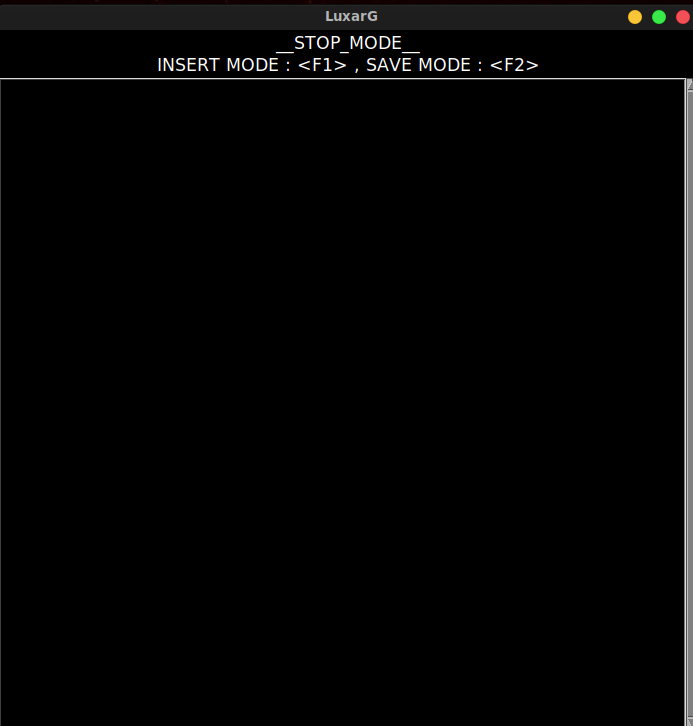

# luxarg :

LUXARG is another keyboard friendly text editor.

This project started at August 2019 and restarted at 2021 TODAY!

Easy to use and user-friendly !

# LUXARG support :

 
Fedora, 

CENTOS,

RedHat,

Debian,

Ubuntu, 

OpenSUSE, 

Arch,

Manjaro

# ICON

# screenshot :

# Licensing

AMZY-0 (M.Amin Azimi .K) 

Copyright (C) (2019-2020-2021)  AMZY-0 (M.Amin Azimi .K) 

"Luxarg" (This program) is free software: you can redistribute it and/or modify
it under the terms of the GNU General Public License as published by
the Free Software Foundation, either version 3 of the License, or
(at your option) any later version.

This program is distributed in the hope that it will be useful,
but WITHOUT ANY WARRANTY; without even the implied warranty of
MERCHANTABILITY or FITNESS FOR A PARTICULAR PURPOSE.  See the
GNU General Public License for more details.

You should have received a copy of the GNU General Public License
along with this program.  If not, see <http://www.gnu.org/licenses/>.

# KEYS : 

    INSERT MODE : <F1>
    SAVE   MODE : <F2>
    OPEN   MODE : <F3>
    HELP   MODE : <F4>
    DELETE ALL  : <Ctrl + 0>
    SELECT ALL  : <Ctrl + />
    CORSUR RIGHT: <Ctrl + f> move the cursor forward one space.
    CORSUR LEFT : <Ctrl + b> move the cursor backward one space.
    Copy        : <Ctrl + c>
    Paste       : <Ctrl + v>
    Cut         : <Ctrl + w>
    UNDO        : <Ctrl + z>
    REDO        : <Ctrl + Shift + z>
    HELP   CLI  : luxarg <-h/--help>
    ZOOM IN     : <Ctrl + equal(=)>
    ZOOM OUT    : <Ctrl + minus(-)>

# INSTALLATION

You must install "pip" before installation   

    $ make 

    # or

    $ make install clean #(optional and the better method) 

# dependencies
    
    $ pip3 install -r requirements.txt

# update method
    
    $ luxarg-update (v1.0)

# Install pip
    pip.txt

# local execute 
    $ make local clean && python<3.SUB_VERSION> core.py
    # OR
    $ make local && python<3.SUB_VERSION> core.py